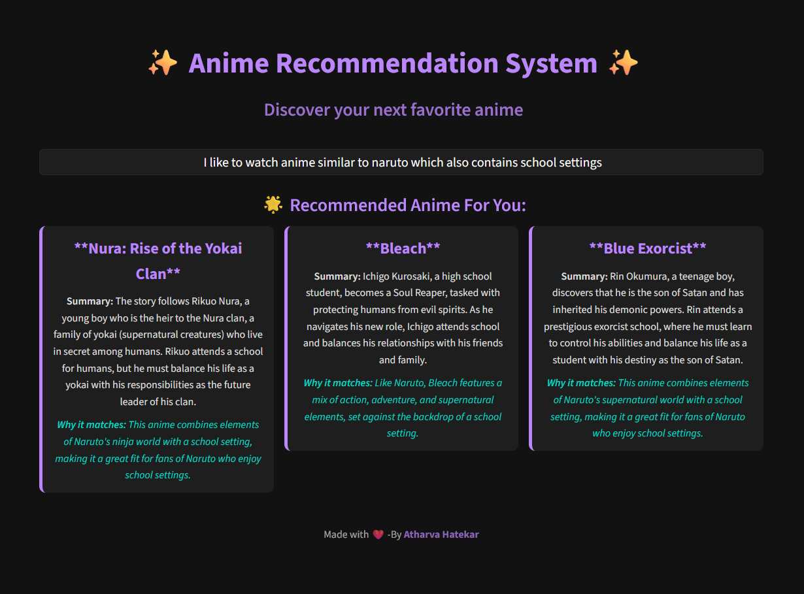

# End-to-End AI Anime recommendation System

## 🌟 Overview

This is an LLM-powered recommendation engine that provides personalized anime recommendations. It's built with a modern MLOps stack for scalability and observability, featuring a user-friendly interface created with Streamlit.

## 🏗️App Preview

## 🛠️ Technology Stack

-   **Frontend:** Streamlit
-   **Backend:** Python (Flask/FastAPI)
-   **AI/LLM:** LangChain, Hugging Face, GroqCloud
-   **Database:** Chroma (Vector DB)
-   **Infrastructure:** Docker, Kubernetes (Minikube for local), GCP
-   **Observability (AIOps):** Grafana Cloud

